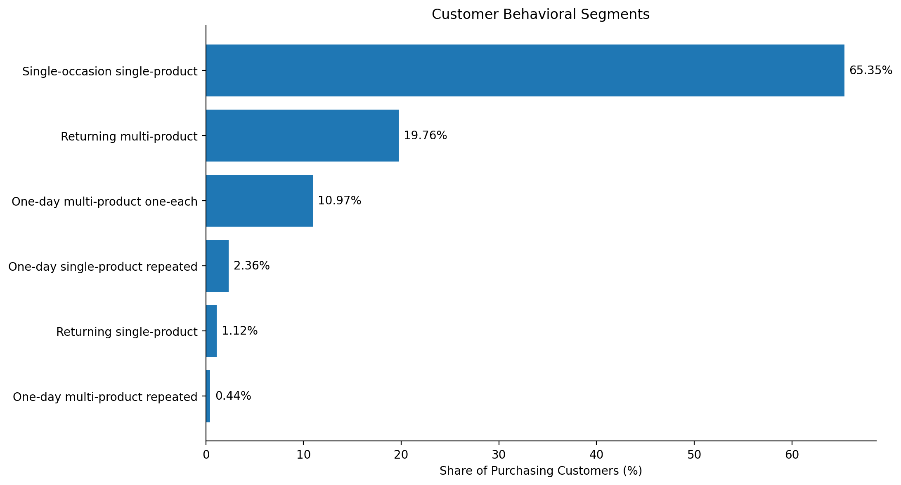
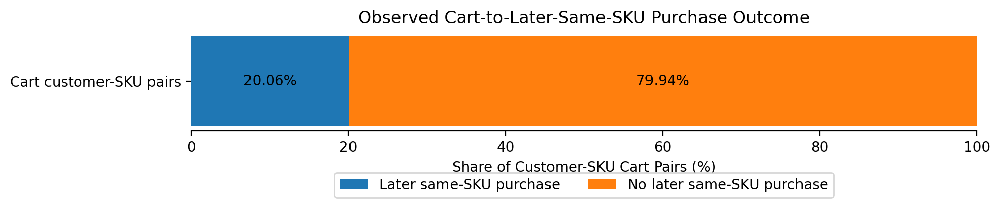
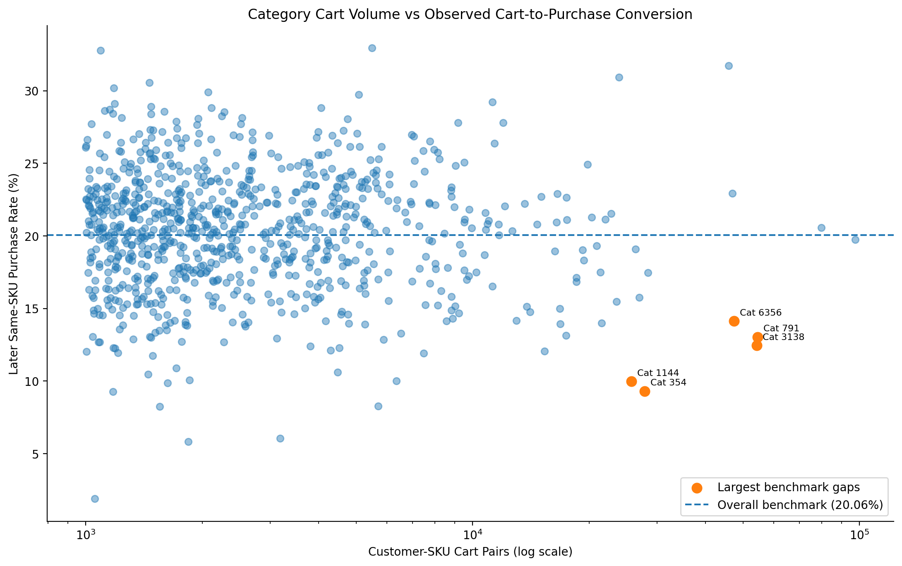
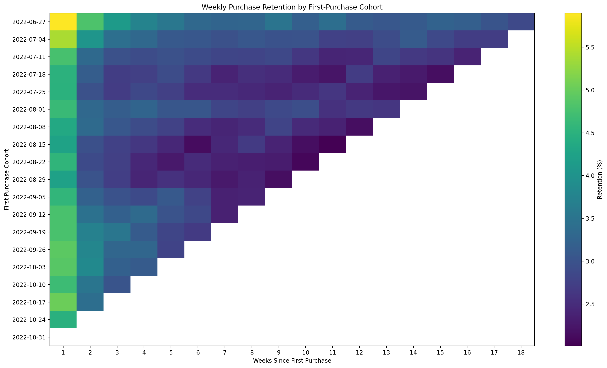
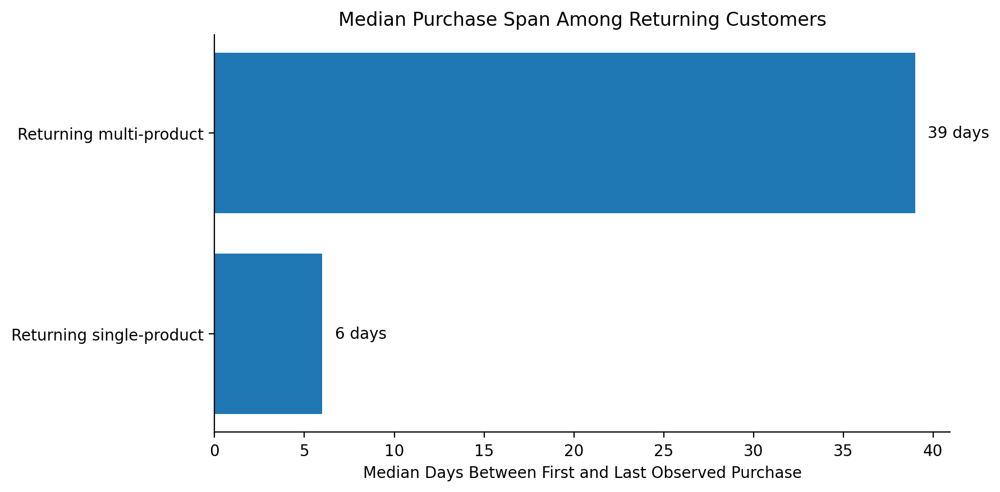

# E-commerce Product Analytics: Funnel, Retention & Customer Behavior

A product analytics project using the **Synerise RecSys Challenge 2025** e-commerce behavioral dataset to investigate customer purchase behavior, cart-to-purchase progression, retention, behavioral segments, and product opportunities.

## Project Overview

The project analyzes large-scale anonymized e-commerce behavioral data to answer four core product questions:

1. How do customers behave after their first purchase?
2. How often does observed cart intent progress to a later purchase of the same product?
3. Where does cart-to-purchase performance vary across product categories?
4. What behavioral patterns distinguish deeper returning customers?

The analysis combines customer behavior, funnel analysis, cohort retention, behavioral segmentation, and experiment-oriented product recommendations.

## Dataset

Source: **Synerise RecSys Challenge 2025**

The raw dataset contains more than **170 million behavioral events** across:

- add-to-cart events
- purchase events
- remove-from-cart events
- page visits
- search queries
- product metadata

The main product analysis focuses on purchase events, add-to-cart events, product metadata, customer-SKU behavior, and weekly purchase activity.

Raw data is **not included in this repository**.

## Key Methodological Decisions

### Purchase occasions

Exact repeated `(client_id, timestamp, sku)` purchase rows were found in the raw data.

Because the dataset does not establish whether these rows represent quantity or duplicated logging, behavioral analysis uses unique:

`client_id + timestamp + sku`

combinations as observed purchase occasions.

### Cart-to-purchase funnel

The dataset does not contain explicit order IDs, cart IDs, checkout IDs, or session IDs.

The funnel therefore uses unique:

`client_id + sku`

pairs.

A pair is considered to show observed cart-to-purchase progression when the customer adds the SKU to cart and later purchases the same SKU.

This is therefore a **cart-to-later-same-SKU purchase rate**, not a conventional checkout conversion rate.

### Retention

Customers are assigned to weekly cohorts based on the week of their first observed purchase.

Incomplete boundary weeks are excluded, and later retention periods use only cohorts with sufficient observable history.

## Key Findings

### Customer behavior

- Purchasing customers: **744,980**
- **65.35%** were single-occasion, single-product customers.
- **79.12%** purchased on only one observed calendar day.
- **20.88%** purchased on multiple calendar days.
- Median first return among customers who returned: **21 days**

### Cart-to-purchase progression

- Unique customer-SKU cart pairs: **4,378,772**
- Later same-SKU purchase pairs: **878,356**
- Observed progression rate: **20.06%**
- **78.63%** of eventual converters purchased within 1 hour.
- **90.02%** converted within 24 hours.
- Median cart-to-purchase time: **~6.9 minutes**

### Retention

Among cohorts with at least 12 weeks of observable history:

| Lifecycle week | Weekly retention |
|---|---:|
| Week 1 | 4.89% |
| Week 2 | 3.59% |
| Week 4 | 3.11% |
| Week 8 | 2.78% |
| Week 12 | 2.61% |

The largest retention decline occurred during the early post-purchase lifecycle.

### Behavioral segmentation

Among returning customers:

- **94.62%** were multi-product customers.
- Returning multi-product customers had a **39-day median purchase span** versus **6 days** for returning single-product customers.
- **98.87%** of returning multi-product customers purchased at least one new SKU after their first purchase day.

## Product Opportunities

The analysis identifies four product areas for further investigation:

1. **Cart-to-purchase progression**  
   Investigate immediate purchase friction, particularly in high-volume categories with below-benchmark performance.

2. **Second-purchase activation**  
   Test post-purchase experiences designed to help first-time purchasers reach a second purchase.

3. **Category-specific funnel optimization**  
   Prioritize categories using both conversion weakness and cart volume rather than raw conversion rate alone.

4. **Cross-product expansion**  
   Test whether relevant complementary or personalized product discovery can increase new-product adoption after the first purchase.

These are product hypotheses derived from observational evidence and would require controlled experiments before causal conclusions are made.

## Visual Highlights

### Customer Behavioral Segmentation

The customer base is dominated by single-occasion, single-product behavior, while returning multi-product customers form the largest deeper-engagement segment.



---

### Cart-to-Later-Same-SKU Purchase Outcome

Only **20.06%** of unique customer-SKU cart pairs were followed by a later observed purchase of the same SKU.



---

### Category-Level Conversion Opportunity

High-volume categories show substantial variation in cart-to-purchase progression. Categories below the overall benchmark can be prioritized using both conversion weakness and cart volume.



---

### Weekly Cohort Retention

Weekly purchasing activity declines most sharply early in the post-purchase lifecycle before stabilizing at a smaller recurring base.



---

### Returning-Customer Behavioral Depth

Returning multi-product customers had a substantially longer observed purchasing relationship than returning single-product customers.


## Tools Used

- Python
- Pandas
- PyArrow
- NumPy
- Matplotlib
- Seaborn
- Kaggle Notebooks
- Parquet

## Repository Structure

```text
ecommerce-product-analytics/
│
├── README.md
│
├── notebooks/
│   └── ecommerce_product_analytics.ipynb
│
├── images/
│   ├── behavioral_segments.png
│   ├── cart_conversion.png
│   ├── category_opportunity.png
│   ├── cohort_retention.png
│   └── returning_customer_span.png
│
└── requirements.txt
